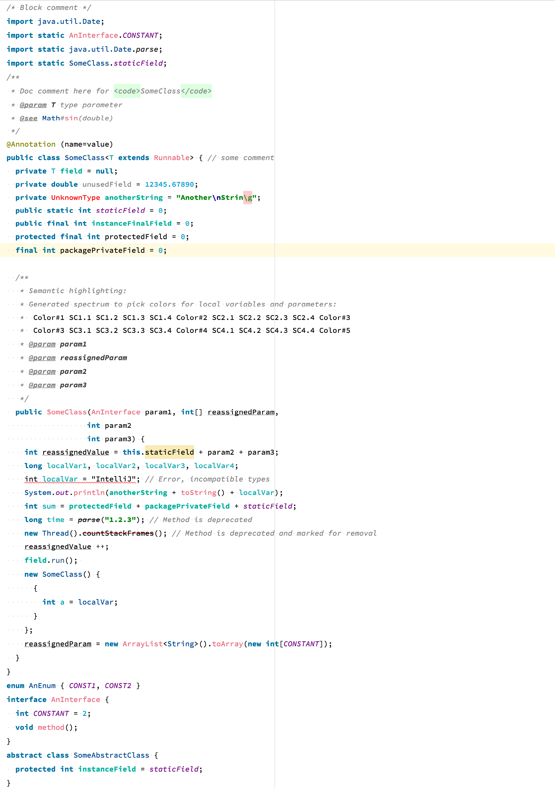

**jsk-light** is light color scheme for Intellij Idea.

Currently jsk-light provides matching colors for these languages/file types.

* Java
* Python
* Ruby
* Scala
* XML
* Yaml
*  ...

## Screenshot

## License

 jsk-light by jsssk is licensed under a <a rel="license" href="http://creativecommons.org/licenses/by/3.0/">Creative Commons Attribution 3.0 Unported License</a>.

  [1]: http://www.decodified.com/misc/2011/06/15/blueforest-a-dark-color-scheme-for-intellij-idea.html
